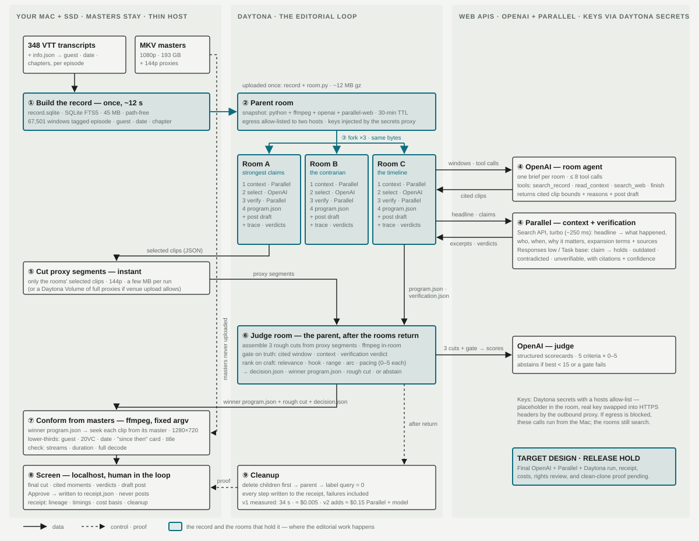

# OnRecord

**OnRecord finds what your podcast guests already said about today's news and turns it into a clip with the proof on screen.** 20VC has 1,271 episodes, and its host has publicly offered $50,000 for a tool that mines the back catalogue — twice.

> **Repository track — Claude comparison build (`onrecord_alt`):** this public branch currently contains the README and its public-facing documentation assets only. The application source is still being built and is not published here yet.

> **Status — 30 August 2026:** the local vertical slice is verified against the 174-episode SSD record: three GPT-5.6 Luna proposals, Parallel context and truth gate, a four-source 1280×720 Receipts clip, Chrome playback, thumbnails, and cleanup. Provider execution inside live Daytona, the 90-second video, clean-clone proof, and media-rights review remain **HOLD** until separately evidenced.

▶ **90-second demo:** pending the verified final run



## The problem, in the customer's own words


Harry Stebbings runs 20VC — 1,271 episodes on YouTube alone, three to four new ones a week. He has asked for this tool in public **four times in ten months, with prices attached**. It is still unsolved.

| Date | What he said | What he'd pay | Source |
|---|---|---|---|
| 24 Aug 2025 | "Not one is able to do this at human quality today." A tool that perfectly edits audio podcasts — and video. | $30,000/yr, plus $30,000/yr for video | [post](https://x.com/HarryStebbings/status/1959610746691637471) |
| 4 Feb 2026 | Descript, the team's core editor, has no offline mode. | 5× the subscription | [post](https://x.com/HarryStebbings/status/2019138464462381351) |
| 11 Feb 2026 | 20VC has an "insane back catalog." He wants a tool that crawls it, finds the best segments and turns them into engaging clips — and one that reads past social performance, writes copy, picks posting times and posts. *"This is what AI should be doing but is not."* | $50,000, plus another $50,000 | [post](https://x.com/HarryStebbings/status/2021525850940678204) |
| 12 Jun 2026 | The team builds clip compositions on the audio file in Descript, then recreates the same clips by hand on the video file; the Descript–ChatGPT integration doesn't carry them across. | $500 to whoever fixes it | [post](https://x.com/HarryStebbings/status/2065498231803466184) |

### Issues logged from those posts

1. **Nobody mines the back catalogue.** Every clipping tool starts from one file — usually the newest — and finds its best minute. The other 1,270 episodes never get opened.
2. **Selection isn't at human quality.** A wrong or context-stripped quote under the 20VC name is a liability, so nothing the tools produce can be trusted without a person re-checking it.
3. **Audio decisions don't carry to video.** The same edit is made twice, by hand.
4. **Selection is disconnected from distribution.** Copy, timing and posting are a separate manual job, and nothing learns from what worked.
5. **The market answered with bots.** People replied to the $50k post offering custom agents; four months later he was still asking.

### Why the tools fail

They have no **system of record**. Without *who said what, when, in which episode, at which timestamp*, an agent can't search a catalogue, can't cite, and can't be trusted to publish. And the value is urgent: a take is worth the most the day the news breaks and nothing 48 hours later — which is exactly why it never gets done by hand. The best clip is almost never in the newest episode, but every workflow starts there.

### What OnRecord answers

| His ask | Today | Next |
|---|---|---|
| Crawl the back catalogue, find the best segments | One record of 174 episodes (17 months, 225 hours); three agent rooms with different briefs; every moment cited by episode, guest, date and timestamp; every claim checked against today's web | The full 1,271 |
| Turn them into engaging clips | A multi-episode cut with attribution burned in and a "since then" card where a claim has been overtaken | Portrait reframe |
| Write copy, pick the time, post | A draft post with receipts; a human approves | Posting after approval; learning from past post performance |
| Audio edit → video | `program.json` is the single edit contract; the cut lands in Final Cut with a citation on every marker | Descript composition import |
| Human quality | The gate: nothing ships that isn't cited, in context and verified; the judge abstains rather than guesses | — |

## What the demo will show

1. Type a headline into Codex: *"Nvidia just fell 8% on AI capex worries — find the receipts."*
2. A Daytona parent room appears, followed by three isolated rooms: **strongest claims**, **the contrarian**, and **the timeline**.
3. The flight recorder shows each room asking Parallel for current context, an OpenAI agent searching the archive, reading around every quote, and verifying each claim.
4. The parent becomes the judge room: it **gates on truth, ranks on craft**, and either selects a cut or abstains.
5. The winning edit returns to the Mac. Local masters become a 1280×720 cut with guest/date attribution, "since then" cards, and citation markers in Final Cut Pro.
6. A human approves; nothing posts automatically. Daytona rooms are deleted children-first and reconciled to zero in the receipt.

**The flight recorder is the demo:** every query, citation, verdict, edit decision, hand-back, and cleanup step is visible rather than narrated.

## Why the sponsors matter

| Sponsor | Role in one run | Why it is necessary |
|---|---|---|
| **Daytona** | One prepared parent, three disposable editorial rooms, then the judge and cleanup proof | The rooms need the same private record, different briefs, isolation from each other, and a lifecycle we can prove ended |
| **OpenAI / Codex** | Codex triggers the run and built this repo; OpenAI agents search cited windows and judge structured candidates | Models propose editorial intent while deterministic validators enforce clip bounds, rendering, and abstention |
| **Parallel** | Current headline context plus cited claim verification | The archive knows the past; Parallel establishes what changed today |

## Release contract

These commands become public claims only after they pass from a clean clone:

```bash
make setup
make demo  # synthetic three-episode fixture; no SSD and no keys
make run   # local UI
```

The agentic local path requires OpenAI and Parallel credentials. Live Daytona additionally requires existing host-restricted organization Secrets, `ONRECORD_ROOM_AGENTS=1`, and an explicit `VVH_ALLOW_LIVE=1` opt-in. Real keys never belong in Git, logs, rooms, or receipts.

## Built today vs reused

| New OnRecord work to evidence today | Reused from earlier prototypes |
|---|---|
| Archive record with guest/date/chapter; three agent briefs; OpenAI tool loop; Parallel context and verification; truth gate; judge room; attributed multi-episode conform; flight recorder; Final Cut markers; human approval | Capsule builder and VTT parsing; Daytona copy-fork lifecycle and cleanup; FFmpeg validation; receipt model; FCPXML export |

Pinned sources and the disclosure rule are in [REUSE_AND_ATTRIBUTION.md](REUSE_AND_ATTRIBUTION.md).

## Honest limits

- The verified Daytona precursor uses **copy-fork**, not a native VM snapshot; the receipt labels that boundary.
- Guest names are derived heuristically from episode metadata, and auto-captions can be wrong.
- Model judgment is not editorial approval. OnRecord must abstain rather than invent, and a human owns the final cut.

## Media rights

No private media belongs in this repository. Masters, transcripts, and high-resolution proxies remain on the owner's drive. The screenshot above is a public post by its author, reproduced with a link to the original; every other public screenshot, clip, quote, transcript excerpt, logo, and receipt requires human review.

Release stays on **HOLD** until every gate in [PUBLIC_RELEASE_CHECKLIST.md](PUBLIC_RELEASE_CHECKLIST.md) is complete.
